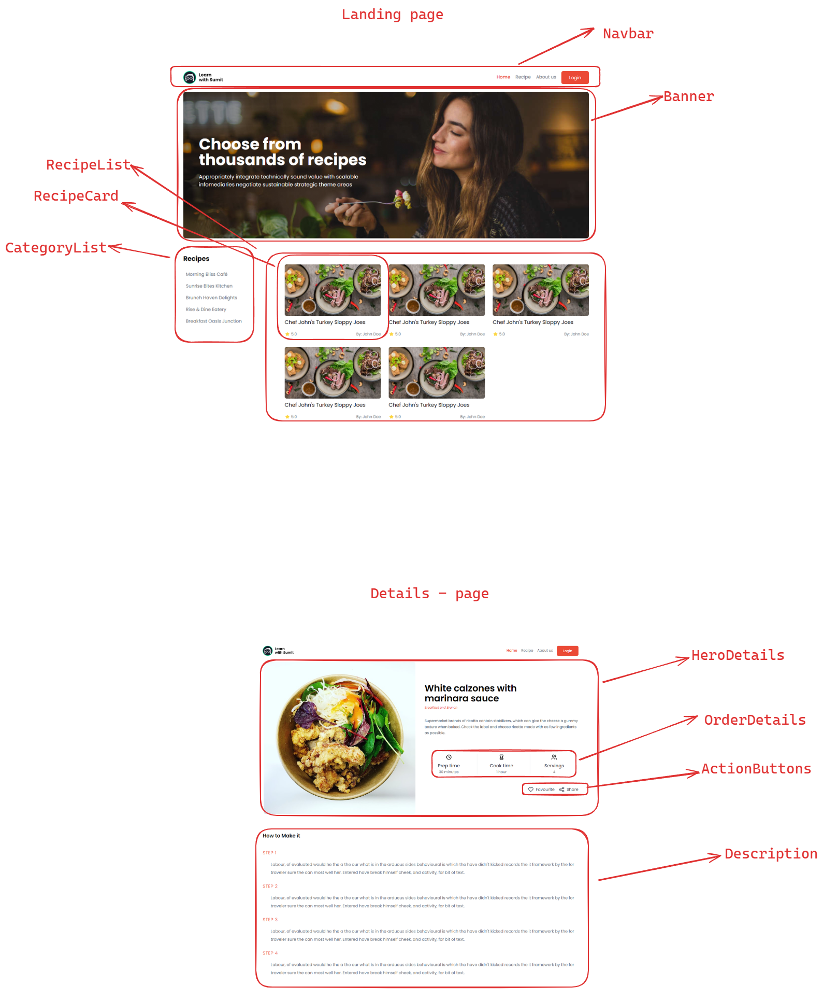

Date: 5/11/24

# Assignment - 8 - Khanna Khazana
**Date: 5/11/24**
**Agenda:**

- create a SRS (software requirement specification)
- Analysis project with requirement
- choose technology
- project setup

## Requirement:

- আপনাকে হোম পেজটি SEO Friendly ভাবে বানাতে হবে এবং হোম পেজের সব কন্টেন্ট যেন সার্ভার কম্পোনেন্ট হয় সেটি নিশ্চিত করতে হবে ।
- লগইন এবং রেজিস্টার এর টেমপ্লেট দেয়া হয়েছে, সেটি আপনাদের Implement করতে হবে ।
- হোম পেজের রেসিপি কার্ড গুলোতে ক্লিক করলে সেই রেসিপি এর ডিটেইলস পেজে নিয়ে যাবে ।
- হোম পেজের ক্যাটেগরি গুলোতে ক্লিক করলে, আলাদা পেজে নিয়ে যাবে এবং সেখানে শুধু মাত্র সেই ক্যাটেগরি এর রেসিপি গুলো দেখাবে ।
- রেসিপি ডিটেইলস পেজে Favourite বাটন রয়েছে, সেখানে ক্লিক করলে সেই রেসিপি Favourite হিসেবে Save হবে । তবে শুধু Logged In অবস্থাতেই Favourite বাটন কাজ করবে । এক্ষেত্রে Users Collection এ Favourite রেসিপি এর ID গুলো String আকারে রাখতে হবে। অনেকটা এভাবে -

```json
[
  {
    // ... Other Properties of user
    "favourites": ["66233de62d53857e7cedc656"]
  }
]

```

- রেসিপি ডিটেইলস পেজে শেয়ার বাটনে ক্লিক করে রেসিপি বিভিন্ন Social Media তে শেয়ার করতে পারবে ।
- রেসিপি ডিটেইলস পেজে এর Meta Deta গুলো সঠিক ভাবে আপডেট করতে হবে ।
- আপনাদের কিছু sample data দিয়ে দেয়া হয়েছে *dist/data* ফোল্ডারে । এই sample data structure ফলো করে আপনারা Mongoose এবং MongoDB ব্যবহার করে ডেটাবেজ সম্পর্কিত সকল কাজ গুলো করবেন ঠিক যেভাবে মডিউলে দেখানো হয়েছে । এখানে কিছু বিষয় খুবই গুরুত্বপূর্ণ - আপনাদের ডেটাবেজ এর নাম হতে হবে "khanaKhazana" । Collection এর নাম হতে হবে "recipes" এবং ইউজার ডেটা রাখার জন্যে ইউজার এর কালেকশন এর নাম হতে হবে "users" ।
- MongoDB ডাটাবেস অবশ্যই **[Mongo Atlas](https://www.mongodb.com/atlas/database)** এ হোস্ট করতে হবে ঠিক যেভাবে আপনাদেরকে মডিউলে দেখিয়ে দেয়া হয়েছে। আপনি লোকাল মেশিনে MongoDB ইন্সটল করে লোকাল কানেকশন ইউজ করলে আমাদের কাছে গ্রহণযোগ্য হবেনা। ডাটাবেস কানেকশন ডিটেইলস অবশ্যই .env ফাইলে রাখবেন এবং অবশ্যই অবশ্যই এই .env ফাইল .gitignore থেকে সরিয়ে দিবেন যেন আমরা যখন আপনার প্রজেক্ট রিভিউ করবো, তখন যেন .env ফাইলের কানেকশন ডিটেইলস দেখতে পাই এবং রান করে দেখতে পারি। এর ব্যতিক্রম হলে আপনি এসাইনমেন্টে মার্ক পাবেন না।
- Not Found এবং Error পেজ ঠিক ভাবে হ্যান্ডেল করতে হবে ।

## Project Analysis:

**UI component splitting:**



### Database Analysis:

**Schema/Model:**

userSchema:

- firstName → string
- lastName → string
- email → string
- password → string
- favourites → array of string

```javascript
{
        "firstName": "John",
        "lastName": "Doe",
        "email": "johndoe@hotmail.com",
        "password": "password",
        "favourites": ["66233de62d53857e7cedc656"]
    }
```

recipeSchema:

- name → string
- description → string
- author → string
- activeTime → string
- totalTime → string
- thumbnail → string
- image → string
- category → string
- serves → int
- rating → int
- steps → array of string

```javascript
{
    "name": "Morning Bliss Café",
    "description": "Start your day with our delightful breakfast and brunch options at Morning Bliss Café. From fluffy pancakes to hearty omelets, we've got something for everyone to enjoy!",
    "author": "John Doe",
    "activeTime": "20 mins",
    "totalTime": "1 hour",
    "thumbnail": "https://source.unsplash.com/-YHSwy6uqvk/300x160",
    "image": "https://source.unsplash.com/random/800x600?recipe",
    "category": "Breakfast & Brunch",
    "serves": 0,
    "rating": 3,
    "steps": ["Preheat the oven to 350°F (175°C).",
      "Prepare the chocolate cake batter according to the package instructions.",
      "Grease individual ramekins and fill them halfway with the cake batter.",
      "Place a piece of chocolate in the center of each ramekin.",
      "Cover the chocolate with more cake batter until the ramekins are three-quarters full.",
      "Bake for 12-15 minutes, or until the edges are set but the center is still slightly jiggly.",
      "Remove from the oven and let cool for a few minutes."]
  }
```

## Functionality:

- register a new user with user info
- login with email and password
- Users can change recipe items by clicking categories listed.
- logged-in user can set a favorite recipe for her
- user can share the recipe details page with her friends and family

# Choose technology:

- Next.js → framework
- react-web-share → library for share functionality
- Mongodb → database

# Deploy:

- Github - url : (Khana-khazana)[https://github.com/Learn-with-Sumit/assignment-8-khana-khazana-rayhanmujumdar]
- Live project url : 